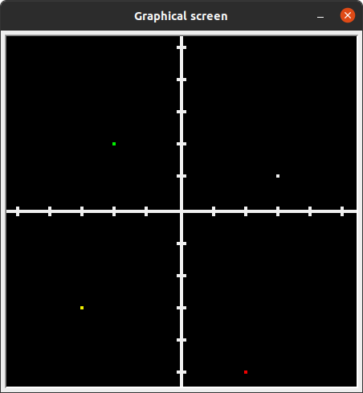
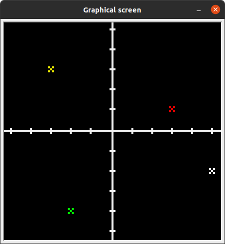
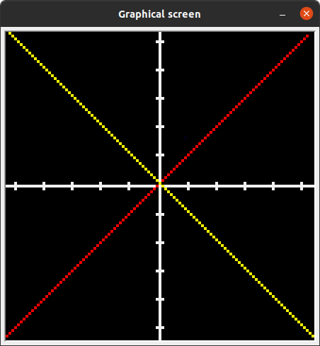
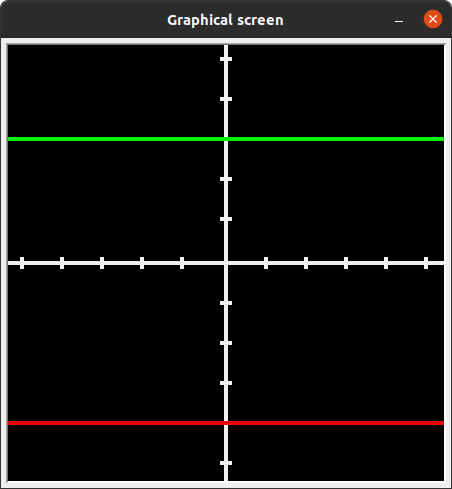
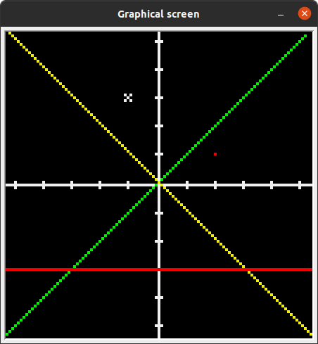
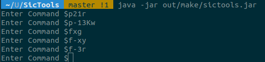
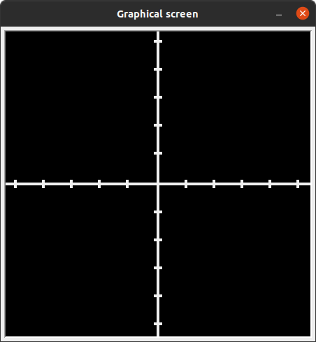

# Coordinate-System
Group Project for System Software ( CSN-252 )

To simulate the project locally, follow the steps:
1. Install SicTools by the following commands: 
```
    git clone https://github.com/jurem/SicTools.git
    cd SicTools
    make jar
```
2. Download the `CoordinateSystem.asm` file from our repo.

3. Run the simulator using the command: ```java -jar out/make/sictools.jar```

4. Load the `CoordinateSystem.asm` file into the simulator

5. Set the frequency to 10000kHz and the screen height and width to 109.

6. Start the simulation and use the `stdin` to give inputs for drawing in the Coordinate System. You can view the outputs in the Graphical Screen.

Commands:

 - input: 
	- color is element of {r - red, w - white, y - yellow, g - green}
	- x, y and n are elements of [-5, 5]
    - draw a point: 
		- pxyK{color}
		- where K is optional and if used will draw the point as a cross
		- p52g  -> draws point at x = 5, y = 2 in green color
		- p-31Kr -> draws point as a cross at x = -3, y = 1 in red color

    - draw a function:
		- functions have two ways of input:
		- y = x and y = -x : fx{color} and f-x{color}
			- y = n: fn{color}
			- f1w -> draws y = 1 function in white color
			- fxy  -> draws y = x function in yellow color
	- clear screen: c
	- exit program: 0

### The following are some snaps of the simulations of our program:

 
 



### Multiple inputs at once:






